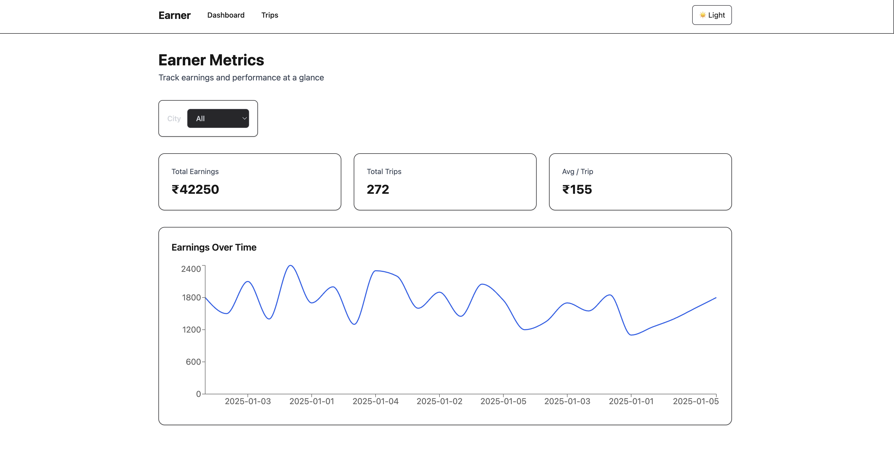

# 🚗 Earner Metrics Dashboard

A production-style **Next.js + React analytics dashboard** that simulates how gig-economy platforms (like Uber) help drivers/couriers track **earnings, trips, and performance metrics**.

Built with a **server-first mindset**, modern **Next.js App Router**, and **Tailwind CSS v4**.

---

### Dashboard



## ✨ Features

- 📊 **Earnings overview** (total earnings, trips, avg per trip)
- 🌆 **Multi-city support** (Bangalore, Mumbai, Delhi, Hyderabad, Chennai)
- 📈 **Time-series earnings chart**
- 🔁 **Dynamic routing** (`/trips/[tripId]`)
- ⚡ **Route-level loading states**
- 🌗 **Light / Dark theme toggle (persistent)**
- 🎨 **Theme-safe styling using CSS variables**
- 🧠 **Server & Client component separation**
- 🚀 **Production-grade folder structure**

---

## 🧱 Tech Stack

- **Framework:** Next.js (App Router)
- **Language:** TypeScript
- **UI:** Tailwind CSS v4
- **Charts:** Recharts
- **State:** React hooks
- **Styling Strategy:** CSS variables + Tailwind utilities

---

## 🗂️ Project Structure

```txt
src/
 ├─ app/
 │   ├─ dashboard/          # Dashboard route
 │   ├─ trips/              # Trips list + dynamic route
 │   │   └─ [tripId]/       # Trip details
 │   ├─ layout.tsx          # Global layout & navigation
 │   └─ page.tsx            # Redirect to /dashboard
 ├─ components/
 │   ├─ Dashboard.tsx
 │   ├─ EarningsChart.tsx
 │   ├─ EarningsSummary.tsx
 │   ├─ Filters.tsx
 │   └─ ThemeToggle.tsx
 ├─ data/
 │   └─ mockData.ts         # Mock earnings data
 └─ types/
     └─ index.ts
```

🎨 Theme Strategy

Uses CSS variables instead of hardcoded dark colors

Cards, borders, and text adapt automatically

Avoids common dark-mode contrast issues

--bg → app background  
--card → card surfaces  
--border → borders

⚡ Routing

File-based routing (Next.js App Router)

Dynamic routes:
/trips/[tripId]

Automatic loading UI using loading.tsx

No manual router configuration.

▶️ Getting Started

# Install dependencies

npm install

# Run development server

npm run dev
